# Baby Express

주문에 맞는 악마 아기를 직접 제작하고 배송하며 사업을 성장시키는 **2D 타이쿤 게임**

- **장르**: 2D Tycoon / Management / Crafting Simulation
- **엔진**: Unity 6
- **언어**: C#
- **플랫폼**: PC / Mobile
- **개발 형태**: 개인 프로젝트
- **개발 기간**: 약 1.5개월 (2026.07.14 ~ 2026.08.31)
- **포트폴리오 구분**: Unity 프로그래머 서브 포트폴리오

<p align="center">
  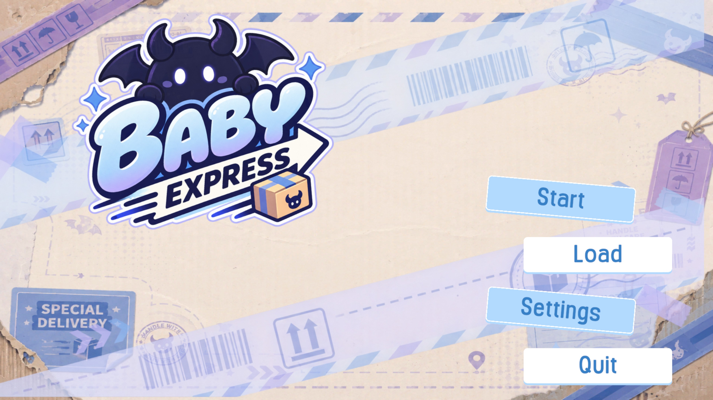
</p>

<p align="center">
  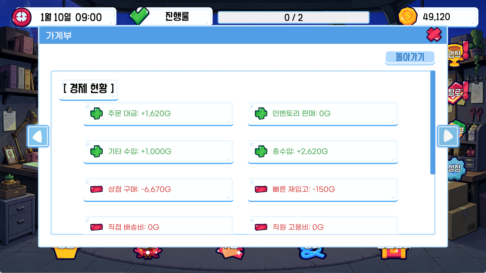
  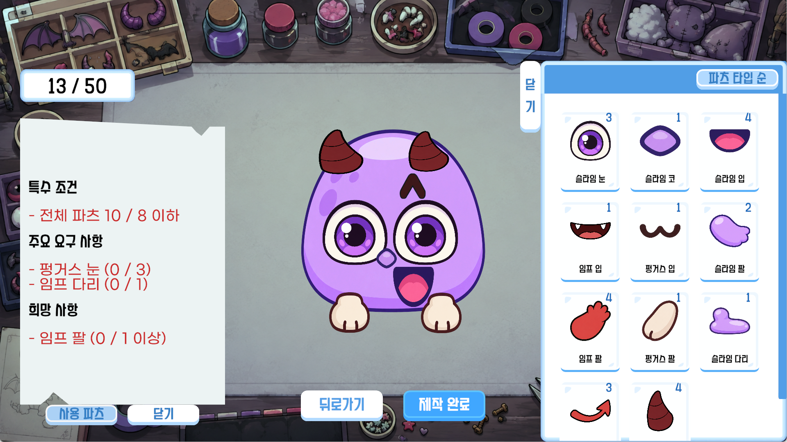
</p>

<p align="center">
  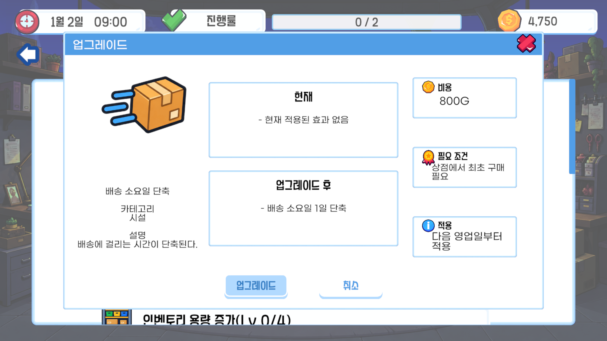
  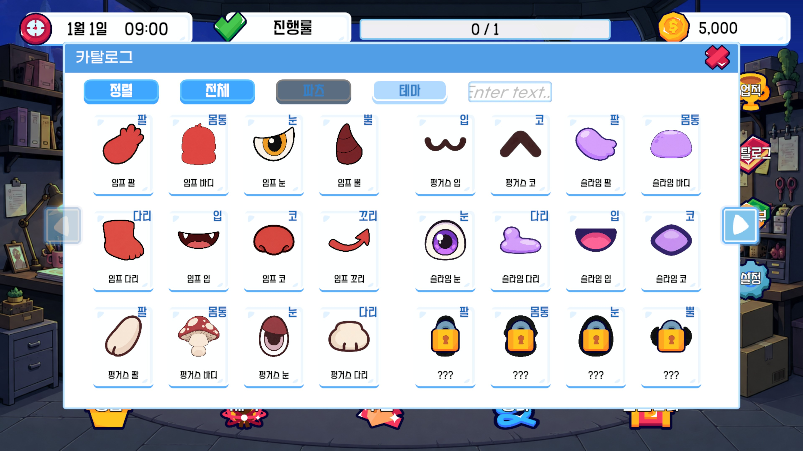
</p>

[플레이 영상](https://youtu.be/cVTqB4s5xGU) · [Build PC](https://drive.google.com/file/d/1GsjZIINrhQZEU3FNOCudNFynJj2ANuqQ/view?usp=sharing) · [Build Mobile](https://drive.google.com/file/d/1lmcdwYobjCouwtLq1C0LpojbNZfjtYNp/view?usp=sharing)

---

## 1. 프로젝트 개요

### 게임 소개

**Baby Express**는 고객에게 악마 아기 제작 주문을 받아 필요한 파츠를 구매하고, 플레이어가 직접 아기를 조립하여 배송하는 2D 타이쿤 게임입니다.  
한정된 예산과 재고 안에서 **주문 조건 / 제작 코스트 / 파츠 시너지**를 고려해 결과를 최적화하고, 제작과 배송으로 얻은 수익을 정비와 운영 성장에 다시 사용합니다.

### 전체 플레이 흐름

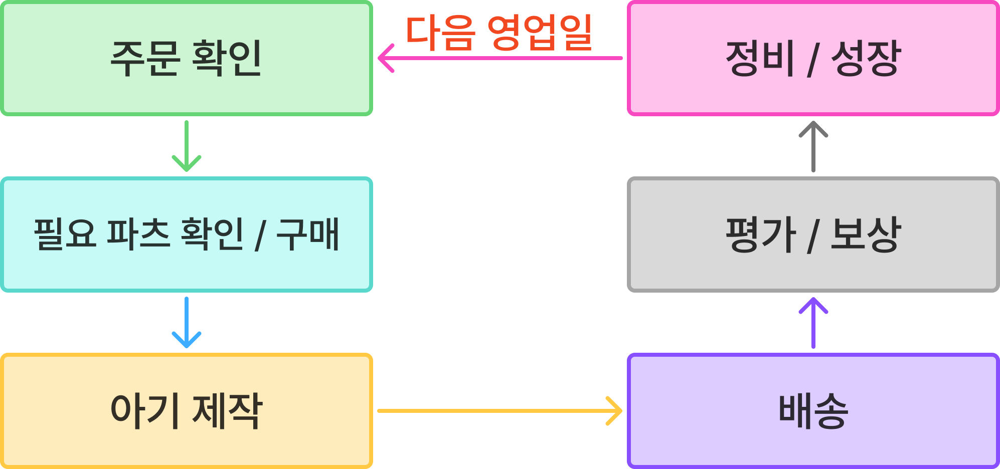

### 주요 구현

- MVP 패턴을 활용한 제작 시스템 구조화
- Object Pooling을 활용한 반복 UI 관리
- 자유 배치 기반 아기 제작 시스템
- ScriptableObject와 Runtime Model을 분리한 데이터 관리
- DOTween 기반 공용 패널 UI 연출

### 전체 게임 아키텍처

`PlayScene`을 최상위 조립 지점으로 두고 Runtime Model과 Presenter / Handler를 조립했습니다.  
주문 → 구매·재고 → 제작 → 배송의 결과는 기록·결산·성장 시스템으로 이어지고, 다음 영업일의 조건에 다시 반영됩니다.

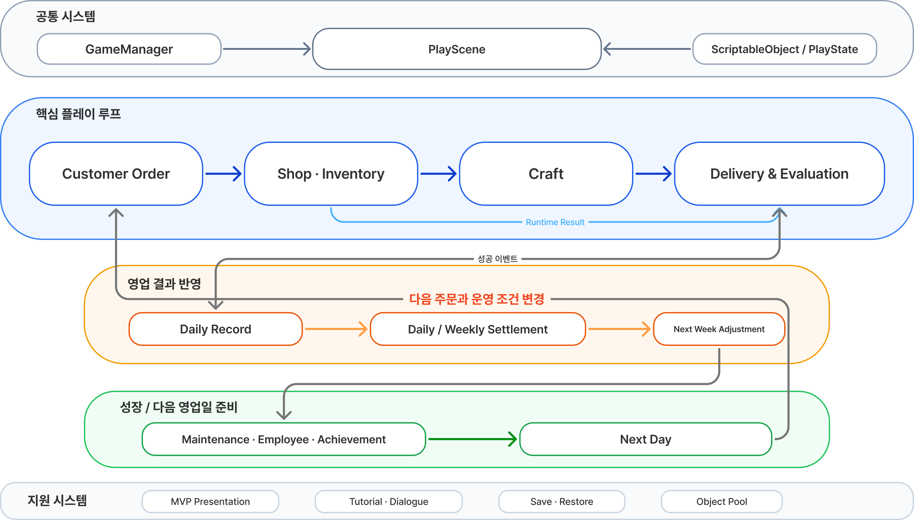

정비·직원·업적의 효과는 별도 규칙으로 다시 구현하지 않고 기존 시스템의 계산 조건에 반영합니다.  
Inventory 용량, Shop 재고·재입고, Order 수량, Craft 점수·할당량, Delivery 기간·비용 등이 이 영향을 받습니다.

---

## 2. 핵심 구현

### 2-1. MVP 패턴 — Craft 시스템

#### 문제

제작 화면은 주문 선택, 파츠 목록, 배치 / 이동 / 스케일, 조건 판정, 점수 표시, 제작 확정까지 여러 기능이 한 화면에서 동시에 동작합니다.  
기능이 늘어날수록 UI 입력, 게임 상태, 판정 로직이 한 클래스에 집중되지 않도록 역할을 분리할 필요가 있었습니다.

#### 해결

게임 상태와 규칙은 **Model**, 입력과 기능 간 흐름 중재는 **Presenter**, 화면 표시와 입력 전달은 **View**가 담당하도록 구성했습니다.

```text
View
[입력 / 화면 표시]
  ↓↑
Presenter
[입력 대상 / 상태 검증, 기능 중재]
  ↓↑
Model
[게임 상태 / 제작 규칙]
```

제작 시스템은 `CraftPresenter` 아래에 주문 목록, 파츠 목록, 파츠 편집, 제작 정보, 제작 확정 기능을 각각 나누어 관리했습니다.

#### 실제 코드 — View → Presenter

**`PartsView.cs`**

```csharp
public void OnPointerDown ( PointerEventData eventData )
{
    if ( eventData.button != PointerEventData.InputButton.Left ) return;
    if ( _isDragging ) return;

    OnSelected?.Invoke( _placementNumber );
}

public void OnScroll ( PointerEventData eventData )
{
    if ( _isSelected == false ||
        Mathf.Approximately( eventData.scrollDelta.y, 0f ) )
        return;

    OnScaleInput?.Invoke(
        _placementNumber,
        eventData.scrollDelta.y );
}
```

View는 입력을 직접 처리하되, 실제 제작 상태를 변경하지 않고 이벤트를 통해 Presenter로 전달합니다.

#### 결과

- UI와 게임 규칙의 책임 분리
- 제작 편집 / 판정 / 확정을 기능별로 독립 관리
- 기능 수정 시 영향 범위를 관련 Presenter / Model로 제한
- 복잡한 제작 시스템의 코드 추적과 디버깅 용이

---

### 2-2. Object Pooling — 반복 UI 슬롯 재사용

#### 문제

상점, 인벤토리, 주문 목록은 정렬 / 카테고리 변경 / 재고 변화에 따라 슬롯 구성이 반복해서 갱신됩니다.  
동일한 UI GameObject를 매번 `Instantiate / Destroy`하면 반복 생성·삭제가 발생하고, 여러 화면에서 슬롯 관리 방식도 제각각이 될 수 있었습니다.

#### 해결

`GameManager`가 소유하는 공용 `PoolManager`와 Unity `ObjectPool`을 사용해 **프리팹 기준으로 슬롯을 대여 / 반환**합니다.

#### 결과

- 반복적인 UI 생성 / 삭제 감소
- 여러 시스템의 동적 목록 관리 방식 통일
- 재사용 객체의 이전 상태가 다음 데이터에 남지 않도록 관리

---

### 2-3. 자유 조립 기반 아기 제작 시스템

Baby Express의 핵심 플레이는 보유한 파츠를 직접 배치해 주문 조건에 맞는 악마 아기를 제작하는 과정입니다.


#### 배치 파츠 데이터 분리

원본 파츠 데이터와 실제 배치 상태를 분리하기 위해, 배치된 파츠마다 `PlacedPartData`를 생성합니다.

배치 상태에는 원본 파츠 정보와 별도로 위치, 스케일, 좌우 반전 등 제작 화면에서 변경되는 값을 저장하고, 같은 파츠를 여러 번 배치하더라도 각각 독립적으로 편집할 수 있도록 구성했습니다.

#### 입력 흐름 통합

```text
Mouse Drag ─┐
Mouse Wheel ├─→ PartsView → CraftPartPresenter → CraftModel
Mobile Drag ┤
Mobile Pinch ┘
```

입력 방식은 View에서 구분하지만 실제 제작 상태 변경 로직은 동일한 Presenter / Model 흐름을 사용합니다.

---

### 2-4. 데이터 관리

상품 / 파츠의 원본 데이터는 `ScriptableObject`, 플레이 중 변하는 가격 / 재고 / 해금 상태는 Runtime 객체와 Model에서 관리합니다.

```text
ScriptableObject
[이름 / 종족 / 파츠 타입 / 기본 가격 / Sprite ...]
          ↓
Runtime Model
[현재 가격 / 재고 / 해금 상태]
```

원본 데이터와 플레이 상태를 분리해 같은 파츠 데이터를 주문 / 상점 / 제작 등 여러 시스템에서 공통으로 참조하도록 구성했습니다.

---

### 2-5. 공용 패널 UI 연출

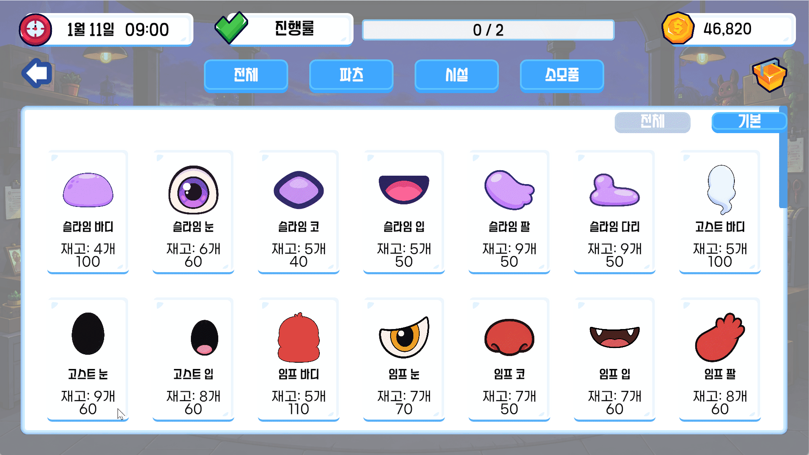

여러 화면의 패널 전환을 각 View에서 개별 처리하면 연출, 입력 제어, Tween 정리 코드가 반복됩니다.

`PanelTweenView`를 공용 컴포넌트로 만들어 **확대 등장 / 수축 퇴장**, 연출 중 입력 제어, 중복 Tween 정리, Hide 완료 Callback을 한 곳에서 처리했습니다.

#### 결과

- 여러 패널에서 동일한 Show / Hide 규칙 재사용
- Tween 진행 중 입력 / Raycast 상태를 일관되게 제어
- 연속 입력이나 비활성화 시 남은 Tween 상태 정리
- 패널 전환에 즉각적인 시각 피드백 제공

---

## 3. 트러블슈팅

### 배치 파츠 재선택 후 스케일 입력 오류

#### 문제

새 파츠 생성 직후에는 휠 스케일이 정상 동작했지만, 선택을 해제한 뒤 기존 파츠를 재선택하면 스케일 입력이 동작하지 않았습니다.  
클릭을 유지하면 위치 이동은 가능했지만 휠 입력은 처리되지 않았고 일부 영역에서만 동작하는 것처럼 보였습니다.

#### 원인

입력 흐름을 단계별로 확인한 결과 하나의 원인이 아니라 다음 문제가 함께 존재했습니다.

- 생성 직후 선택과 재선택의 **선택 확정 시점 불일치**
- 자식 `PartsView` 클릭이 부모 `BabyBuildArea`의 빈 영역 입력까지 전달
- 클릭 중 휠 입력을 일괄 차단해 실제 `클릭 유지 + 휠` 입력까지 차단

#### 해결

재선택을 `PointerDown`에서 즉시 처리해 선택 시점을 맞추고, 파츠 클릭이 부모 빈 영역 클릭까지 전달되지 않도록 했습니다.

```csharp
public void OnScroll ( PointerEventData eventData )
{
    if ( _isSelected == false ||
        Mathf.Approximately( eventData.scrollDelta.y, 0f ) )
        return;

    OnScaleInput?.Invoke(
        _placementNumber,
        eventData.scrollDelta.y );
}
```

Presenter에서는 전달된 배치 번호와 현재 선택 번호를 다시 비교해 다른 파츠의 상태가 변경되지 않도록 했습니다.

```text
PartsView 입력
   ↓
CraftPartPresenter
   ↓
선택 파츠 / 입력 대상 검증
   ↓
CraftModel 변경
```

#### 결과 / 배운 점

선택 해제 → 재선택 → 클릭 유지 → 휠, 다른 파츠 전환, 최소 / 최대 스케일 조건을 반복 검증해 선택 파츠에만 입력이 적용되는 것을 확인했습니다.  
이 과정에서 UI 입력 문제는 개별 이벤트 함수보다 **입력 대상 → 이벤트 시점 → 부모·자식 이벤트 전달 → Presenter 상태 → Model 변경 → View 반영**의 전체 흐름으로 추적해야 한다는 점을 확인했습니다.

---

### 결산 Content 전환 시 스크롤 위치 계승 오류

#### 문제

같은 `ScrollRect`에서 `DailyContent`와 `WeeklyContent`를 교체할 때, 결산을 처음 열면 최하단에서 시작하거나 일일 결산에서 내려간 스크롤 위치가 주간 결산에도 그대로 이어지는 문제가 발생했습니다.

#### 원인

`ScrollRect`는 Content를 교체해도 기존 이동 상태와 스크롤 위치를 유지합니다. 여기에 TMP 텍스트와 `ContentSizeFitter`의 레이아웃 계산이 즉시 끝나지 않아, 새 Content를 연결한 직후 `verticalNormalizedPosition = 1f`를 적용하면 이전 Content 높이를 기준으로 계산되거나 값이 무시되는 경우가 있었습니다.

#### 해결 과정

Pivot 변경, 한 프레임 대기 후 Layout 강제 갱신, 렌더링 완료 후 위치 재설정을 차례로 시도했습니다. 최초 표시는 개선됐지만 **일일 → 주간 Content 전환 시 이전 ScrollRect 상태가 남는 문제**는 해결되지 않았습니다.

최종적으로 Content 교체 전 ScrollRect의 이동을 중단하고 기존 위치를 초기화한 뒤, 새 Content의 TMP / Content Size Fitter 레이아웃 계산이 끝난 시점에 최종 크기를 기준으로 최상단 위치를 다시 확정하도록 변경했습니다.

```text
기존 Content
   ↓
ScrollRect 이동 중단 / 위치 초기화
   ↓
새 Content 연결
   ↓
TMP / Content Size Fitter 레이아웃 갱신
   ↓
최종 크기 기준 최상단 위치 확정
```

#### 결과

- 최초 일일 결산이 항상 최상단에서 시작
- 일일 결산을 스크롤한 뒤 주간 결산으로 전환해도 이전 위치를 계승하지 않음
- 동적 Content 전환 시 **레이아웃 계산 완료 시점과 기존 UI 상태 초기화 순서**를 함께 고려해야 한다는 점을 확인

---

## 4. 기타 구현

핵심 구현 외의 운영 시스템은 실제 게임 화면과 함께 간단히 정리했습니다.

- **상점 / 장바구니**: 재고 / 자금 / 인벤토리 용량을 구매 전에 검증하고 실패 시 부분 구매를 허용하지 않음.
- **인벤토리**: 한 슬롯 최대 99개, 초과 수량은 복수 스택으로 분리하고 부분 스택을 우선 채움.
- **주문**: 주요 요구 / 희망 / 제작 코스트 / 납기 / 진행 상태 관리.
- **배송 / 평가**: 제작 결과를 바탕으로 배송 일정과 최종 평가 / 보상 계산.
- **일일 / 주간 결산**: 영업 결과를 기록하고 다음 영업일로 연결.
- **정비 / 연구 / 직원**: 자금과 진행도에 따라 운영 기능과 콘텐츠 확장.

#### 상점

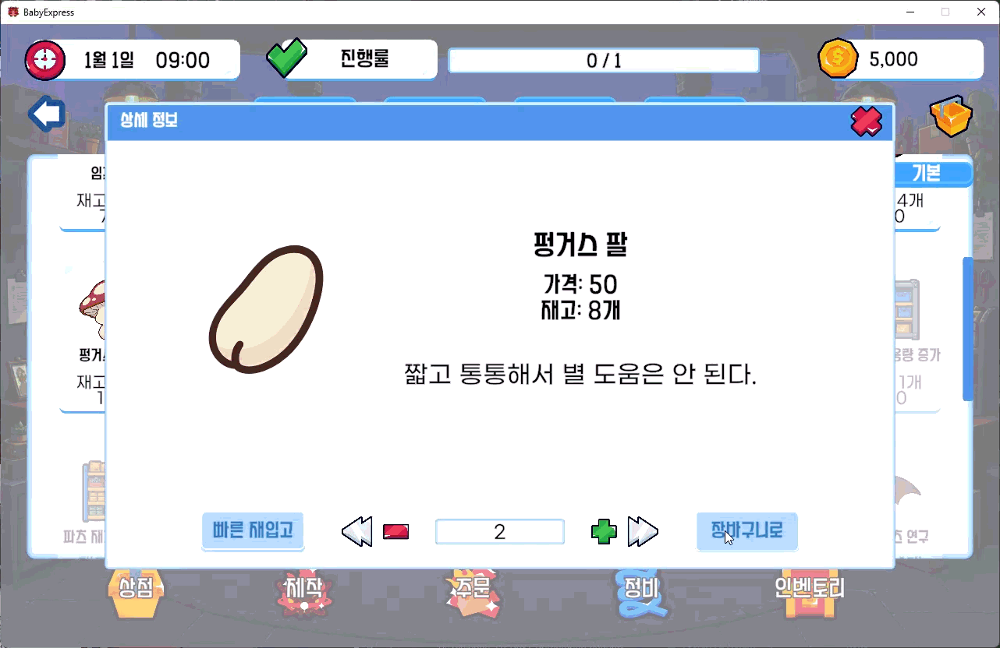

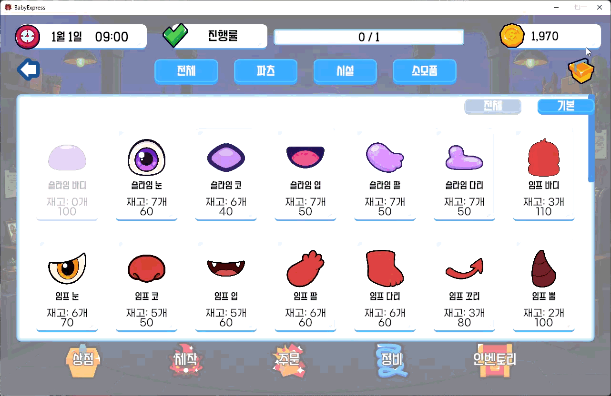

#### 인벤토리

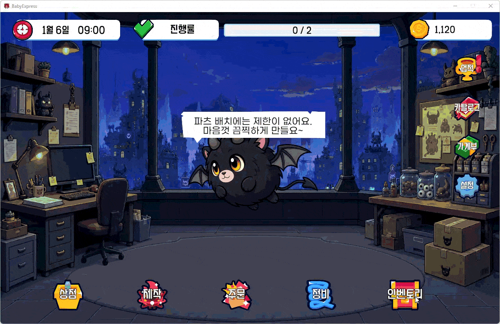

#### 정비


#### 결산 / 부가 기능

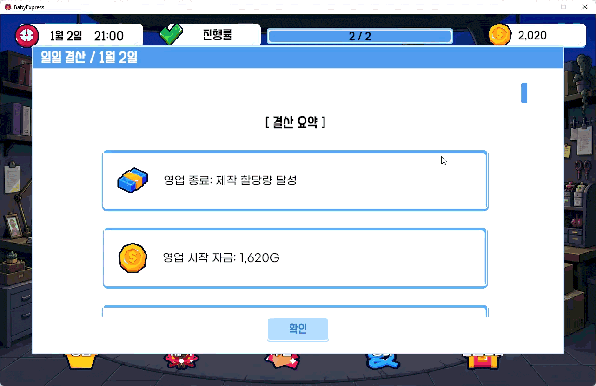

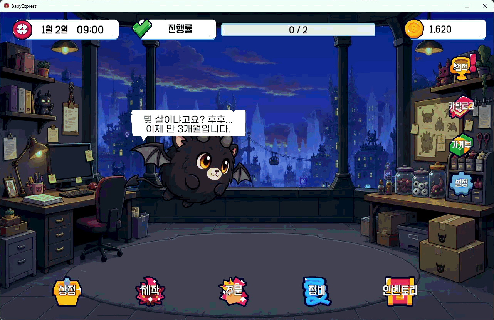


#### 직원 / 대화

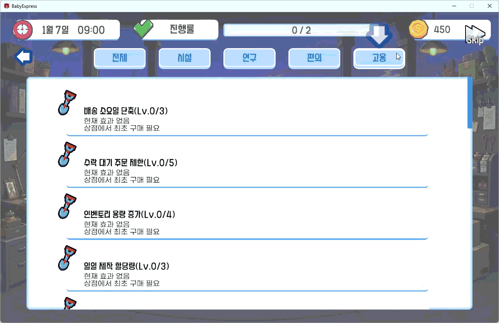

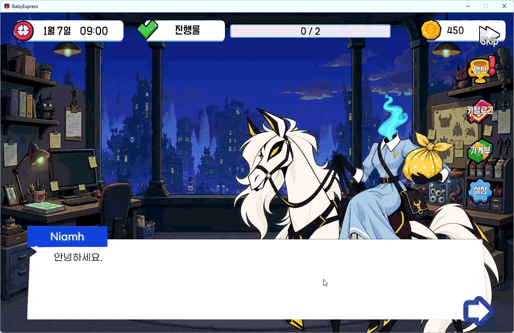

---

## 5. 외부 리소스

### 외부 UI 에셋

실제 `Play` / `Title` 씬 의존성에서 확인된 외부 UI 에셋을 기준으로 정리했습니다.

| 리소스 | 사용 용도 | 제작자 / 출처 |
|---|---|---|
| Paper UI Asset Pack for Games | 공용 UI | Lynda Mc Donald (LoudEyes) · https://loudeyes.itch.io/paper-ui-pack-for-games |
| Simple Vector UI Pack | 공용 UI | PlayPug · https://playpug.itch.io/simple-vector-ui-pack |
| Bliss GUI | 공용 UI | Prinbles |
| Free Icon Pack | UI 아이콘 | gvesster · https://gvesster.itch.io/free-icon-pack |
| Casual Game Buttons Vol. 01 | 버튼 UI | Vektyr · https://realvektyr.itch.io/casual-game-buttons-vol-01 |
| BlueStone Mobile UI | 공용 UI | Evil · Unity Asset Store |
| Gmarket Sans | 폰트 | Gmarket · https://corp.gmarket.com/fonts/ |
| 양진체 v0.93 | 폰트 | 김양진 · https://noonnu.cc/font_page/330 |

### 생성형 AI 활용

악마 아기 파츠, 직원 초상화, 게임용 아이콘 등 일부 2D 리소스는 ChatGPT 이미지 생성 기능을 활용해 제작했습니다.

---

## 6. 개발 회고

### 잘한 점

이번 프로젝트에서는 MVP 패턴을 적용하는 것에 그치지 않고, 개발 과정에서도 **각 Model / View / Presenter가 자신의 역할과 책임에 집중하고 있는지 계속 점검했습니다.**

하나의 클래스가 여러 기능을 동시에 담당하거나 코드가 지나치게 길어지는 경우에는 책임을 다시 나누고, Model / View / Presenter 사이의 역할 경계를 조정하는 방식으로 구조를 정리했습니다.

그 결과 단순히 Model / View / Presenter 형태를 갖추는 데 그치지 않고, **기능 단위로 책임을 분리하고 각 클래스의 역할을 명확하게 유지하는 기준**을 세워 개발할 수 있었습니다.

### 아쉬운 점

구조를 지속적으로 분리하려고 했지만, 프로젝트가 진행되면서 기능이 추가되다 보니 일부 클래스는 예상보다 길어지거나 여러 책임을 가지게 된 부분이 남았습니다.

특히 UI 쪽에서는 구현 과정에서 **Scroll View의 위치·상태 초기화, 버튼 표시 상태, 동적 UI 갱신 시점**처럼 세부 상태 관리에서 반복적으로 실수가 발생했습니다. 기능 자체는 동작하더라도 UI의 이전 상태가 남거나 초기화 타이밍이 맞지 않는 문제가 생기면서, 화면 단위의 상태 관리도 설계 단계에서 더 명확하게 정의할 필요가 있다는 점을 느꼈습니다.

### 다시 개발한다면

다시 개발한다면 구현에 들어가기 전에 각 시스템의 기능을 지금보다 더 세부적으로 나누고, **각 기능의 책임 주체와 상태 변화 흐름을 먼저 정리한 뒤 개발을 시작하고 싶습니다.**

이번에는 기능을 하나씩 추가하며 개발하다 보니 어느 순간 클래스의 길이가 크게 늘어나 있거나, 한 객체가 예상보다 많은 역할을 담당하고 있는 경우를 뒤늦게 발견하기도 했습니다.

다음 프로젝트에서는 개발 전에 `이 기능의 상태는 누가 관리하는가 → 누가 변경하는가 → 누가 화면에 반영하는가`를 먼저 정의하고, UI 역시 **초기 상태 / 갱신 시점 / 화면 전환 시 초기화 조건**까지 함께 설계해서 구현 중 발생하는 구조 변경과 UI 상태 오류를 줄이고 싶습니다.

---

### README 이미지 파일

```text
Docs/Images/
├─ title.jpg
├─ cover_1.png
├─ cover_2.png
├─ upgrade.png
├─ catalog.jpg
├─ play_flow.png
├─ architecture.png
├─ craft.gif
├─ panel_tween.gif
├─ settlement.gif
├─ dialogue.gif
├─ employee.gif
├─ inventory.gif
├─ maintenance.gif
├─ shop_buy.gif
├─ shop_quick_restock.gif
├─ side_action_achv.gif
└─ side_action_catalog.gif
```
